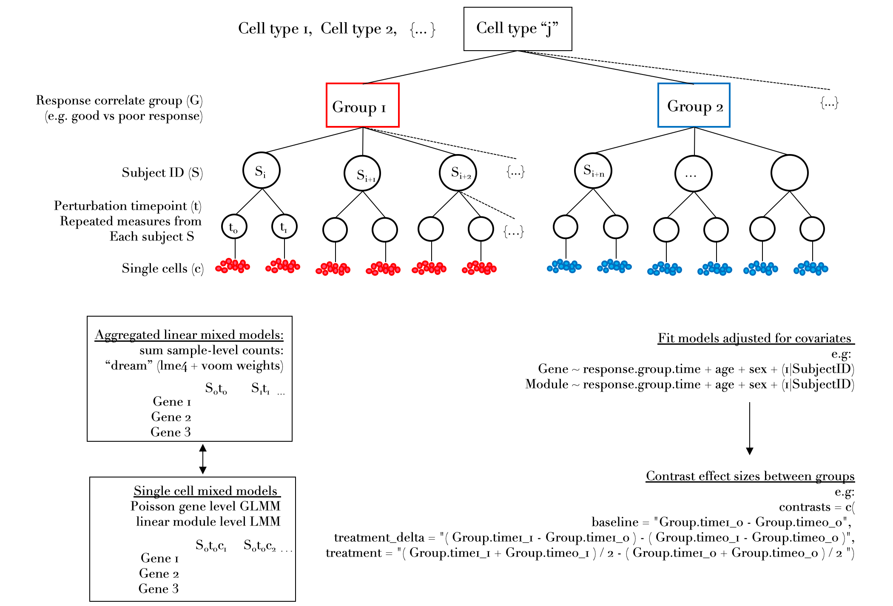

<!-- README.md is generated from README.Rmd. Please edit that file -->

```{r, include = FALSE}
knitr::opts_chunk$set(
  collapse = TRUE,
  comment = "#>", 
  eval = FALSE
)
```

**This package is under active development**

An R package for implementing mixed effects modeling methods on single cell data that can accomodate many different complex experiment designs. The package is built around [lme4](https://www.jstatsoft.org/article/view/v067i01) and was originally made for analysis of single cell data collected from many individuals who are assayed pre- and post- perturbation such as drug treatment, nested within one or more response groups. The methods herein allow one to compare the difference in perturbation response effects between groups while modeling variation in donor expression. It also has many wrappers for downstream enrichment testing and visualization.  

Please see vignettes. 

## Installation  
```{r}
devtools::install_github(repo = "https://github.com/MattPM/scglmmr")
library(scglmmr)
```

  


## Single cell within cluster perturbation response differential expression 

The purpose of this software is to analyze single cell genomics data with pre and post perturbation measurements from the same individuals, including complex designs with many subjects, each subject having repeated measurements pre and post perturbation and each subject nested within in different groups, such as different end point response correlates, e.g. high and low responders. The focus is on implementing flexible generalized linear multilevel models to derive group (i.e. good or poor clinical outcome, high or low rug response) and treatment associated effects *within cell types* defined either by protein (e.g. with CITE-seq data) or transcriptome based clustering followed by downstream enrichment testing and visualization. 

Any number of model covariates can be specified. The vignettes provide methods where a random intercept term for teh donor ID of each cell oraggregated library is incluided in the model. These methods thus model the vriation around the baseline expression across individuals, accomodating  non-independence of expression for repeated timepoints from each subject. 

An overview of methods provided: 

### 1. pseudobulk aggregated models  
These functions implement wrappers around `limma` for fitting fixed effect linear models and the `dream` method from the `variancePartition` package. The dream method is the only way to test differential expression while accomodating 'random' or varying effects. This is statistically necessary to account for non-independence when we have perturbation experiments with repeated measurements from the same donors. To enable linear models (e.g. modeling the mean with a normal distribution) to be fit to gene counts, dream accounts for the mean variance trend via incorporating `voom` observational weights. 

### 2. single cell gene and gene module level mixed effects models
Test perturbation effect using a gene level Poisson mixed model.

### 3. single cell module level mixed effect models    
Test perturbation effects and differences in perturbation responses between groups at the gene module level. 

### 4. Downstream enrichment testing and visualization
There are wrapper functions around multiple gene set enrichment methods, with emphasis on the [fast set gene enrichment (fgsea) package](https://www.biorxiv.org/content/10.1101/060012v2#disqus_thread). The results from fgsea can then be further interrogated by methods for contrasting information content in genes driving enrichments within and between celltypes. Multiple visualization wrappers are also provided.

### Philosophy 
This package models expression within each cluster/ cell type independently in order to capture perturbation effects of cell type specific genes as well as genes that are expressed by multiple cell types. Using a normal distribution on count data requires first modeling the mean variance trend [(see Law et al)](https://genomebiology.biomedcentral.com/articles/10.1186/gb-2014-15-2-r29) this requires filtering features (genes) that are not expressed by a iven cell type. These cell type specific transcripts are therefore tested for perturbation effects within only in the cell types that express the genes, instead of across all cell types. Genes that are shared across cell types can be conpared for coherent perturbation effects across all subjects or between different groups of subjects using contrast coding.  

This approach is particularly well suited for multimodal single cell data where cells are clustered based a independent information from the perturbation effects. For example, we have utilized methods in this package for CITE-seq data where we first denoise ADT data using our method [dsb](https://github.com/niaid/dsb) followed by modeling transcriptome not for differences between cell types, but for the group level perturbation response effects using this package. 

**Experiment designs (within each cluster / celltype) supported by scglmmr**
Below is a 2 group repeated measures experiment. This data can be accomodated by scglmmr. More simple experiment designs are also supported, for example 2 groups with one timepoint or more complex experiments for example 3 timepoints. 

| sample        | sampleid      | timepoint    |   Group        | sex            
| :------------- | :----------: | -----------: | :------------- | :----------: | 
|  101_t0     | 101           | d0           |  good            | F            | 
|  101_t1     | 101           | d1           |  poor           | F            | 
|  102_t0     | 102           | d0           |  good            | M           | 
|  102_t1     | 102           | d1           |  poor           | M             | 
|  ... (x n donors)    | ... (x n donors)           | ... (x n donors)           |  ... (x n donors)           | ... (x n donors)             | 


<!-- badges: start -->
<!-- badges: end -->

Questions?
Pls open an issue. 
