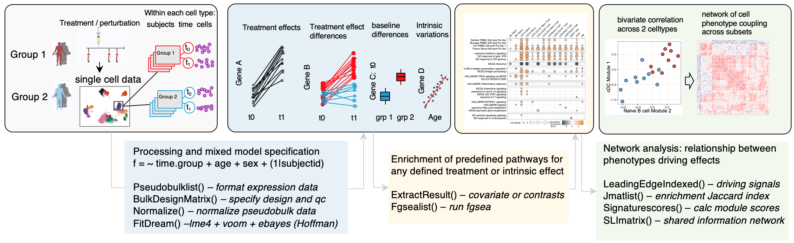

sample-level single cell generalized linear mixed models and phenotype
networks in R
================

<!-- README.md is generated from README.Rmd. Please edit that file -->

*This package is under active development*

This R package supports analysis of single cell data from multi-subject
experiments. The main use case is for testing *within* each cell type /
cluster, the effects of treatment, differences in treatment effect
between groups, baseline differences between groups, and intrinsic
effects such as age or sex on gene expression variation. Testing can be
done at the single cell or data aggregated within each cell subset at
the “pseudobulk” level. Once these effects are defined, functions are
provided to understand relationships between different cell types,
including celltypexsample level scoring transcriptome signals driving an
effect of interest then correlating scores across individuals and cell
types. This creates an interpretable multi cell correlation network
based effects derived from the statistical model as it is based on user
defined effects adjusted for covariates etc.

An overview of methods provided below-see vignettes for more details.

### 1. Aggregated models with correlation network analysis of effects across cell types

Overview of the workflow starting from a single cell data object. For
experiments with repeated measures from the same individuals, mixed
effects models are used to account for non independence of repeated
measures from the same donor. For experiments with a single measure for
each subject, fixed effects models are used. The statistical effect size
of covariates or contrasts from these models can be extracted for gene
set enrichment using `fgsea`. The sample level scores for expression of
the leading edge genes driving each enriched signal are then calculated
and can be used in a correlation network analysis. The methods here add
fdr control to correlation networks and adjust for gene sharing between
leading edge genes from different signatures within the same cell types.

Note this workflow uses wrappers around methods created by others which
should be cited:

Cite [Hoffman et al *Bioinformatics*
2020](https://doi.org/10.1093/bioinformatics/btaa687) is using the
function `FitDream()`, a wrapper around the method `dream`. This
excellent method implements mixed effects models for transcriptome data
by incorporating observational weights and empirical Bayes methods
tailored to models fit with
[lme4](https://www.jstatsoft.org/article/view/v067i01).

Cite [Law et al *Genome Biology*
2014](https://genomebiology.biomedcentral.com/articles/10.1186/gb-2014-15-2-r29)
if using the function `RunVoomLimma`, a wrapper aound the fixed effects
model `Limma + voom` which introduced observational weights to allow
normal based methods for transcriptome count data.

Cite [Korotkevich et al *Biorxiv*
2021](https://www.biorxiv.org/content/10.1101/060012v3) if using the
function `FgseaList()`, a wrapper around a novel Monte Carlo algorithm
for exact enrichment statistics, `fgsea`.

### 2. Single cell gene or module level models

A set of functions test single cell level module activity scores to
derive treatment effects, treatment effect differences between groups
and baseline differences within cell types. As above a random intercept
term for donor accommodates non-independence of expression for repeated
timepoints from each subject. A gene level single cell Poisson model is
also provided. A custom function for experiments with a single
perturbation applied to donors nested in 2 groups, e.g. responders and
non-responders, is also provided for this common experiment design.

### 3. Enrichment and visualization testing

Several functions are provided for interacting with model fits,
extracting effects of interest from all cell types simultaneously,
comparing cell type specific or shared effects, creating lists of gene
signatures, and visualizing results.

### Purpose & philosophy

Multi sample / subject experiments from human cohorts including many
individuals pre and post treatment nested into different ‘response’
groups or treated with different drug perturbations are becoming more
common. The methods developed for early single cell experiments for
comparing cell types do not scale to these types complex highly nested
data. Most notably, assumptions about independence made by methods that
do not adjust for repeated measures (cells) from the same donor are
violated with complex nesting. Consider the structure and effects shown
below. Instead of ignoring or removing subject to subject variations,
multivariate mixed effects models enable integration and quantification
of human population variation inherent in these multi-subject
experiments. The effects of age, sex, ethnicity can all be extracted and
analyzed for enrichment of biological pathways. In addition, one can
utilize the correlation of each signal driving treatment effects or
group level differences across donors to understand relationships
between cell phenotypes across the entire system profiled. The package
uses correlation network analysis and a shared latent information metric
to infer these relationships.

We model expression within each cluster/ cell type independently in
order to capture perturbation effects of cell type specific genes as
well as genes that are expressed by multiple cell types. This is
necessary in order to implement linear methods since the mean variance
trend must be modeld after filtering out genes with near 0 expression
across all individuals for a given cell type. Transcripts are therefore
tested for perturbation effects within only in the cell types that
express the genes, instead of across all cell types. Enrichment and fdr
testing is then done within cell type enabling the extraction of cell
type specific signatures of perturbation response. The package provides
simple methods for extracting such signatures.

The approach in this package is particularly well suited for multimodal
single cell data where separate interpretable information (for example
surface proteins with CITE-seq) are first used for cell type
classification, while mRNA within these defined clusters can be analyzed
for perturbation effects. A workflow we have used in many manuscripts
includes denoising and normalizing ADT data using
[dsb](https://github.com/niaid/dsb), clustering cells based on only
normalized protein levels, then using the workflows described in this
package to integrate human population variation with transcriptome
variations, inferring e.g. drug treatment effects within each protein
based subset.

For examples of use of this package see: [Mulè et al *Immunity* (2024 in
press)](https://www.ncbi.nlm.nih.gov/pmc/articles/PMC10120791/) [Mulè et
al *Biorxiv* (2022 in
press)](https://www.biorxiv.org/content/10.1101/2022.06.05.494592v1.full)

<!-- badges: start -->
<!-- badges: end -->
