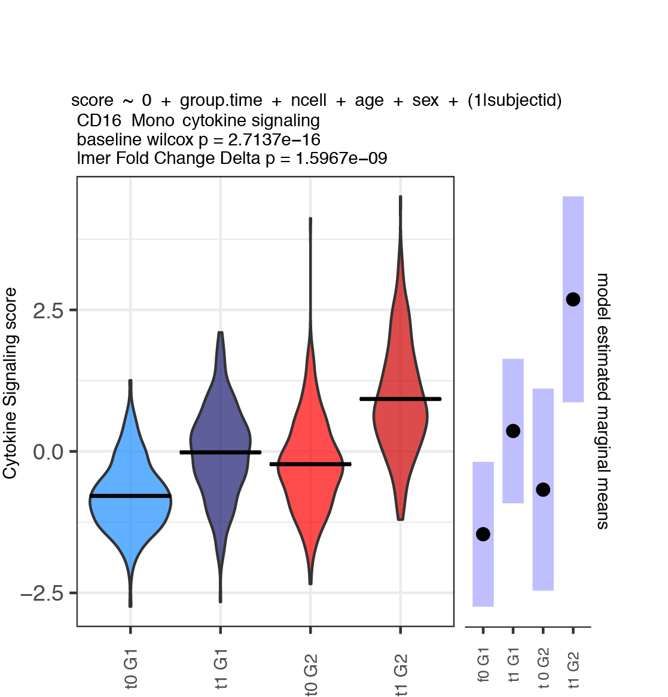

```{r, include = FALSE}
knitr::opts_chunk$set(
  collapse = TRUE,
  comment = "#>", 
  eval = FALSE
)
```

```{r, eval = FALSE}
library(scglmmr)
```


### Single cell gene module level testing.  

Compare single cell level module score responses across groups. As in the pseudobulk vignette, fit models within each cell type adjusting for covariates using a random intercept term for each donor. Functions used in this workflow include: 

`WeightedCellModuleScore` - score each module activity for each cell; any method can be used here. Below we discuss relative vs absolute scaling across cells vs within cell types for effect size interpretation. 

`FitLmer` - fits a linear model using lme4 notation to the module scores. Returns a nested list of model results that can be queried to extract effects of interest. 

`FitLmerContrast` - as above, but specifically designed for 2 group 2 timepoint repeated measures perturbation designs. Automatically calculates baseline differences, treatment effect across subjects and difference in treatment effects between groups using the [emmeans](https://cran.r-project.org/web/packages/emmeans/index.html) package. 

A plot as shown below is generated for each module x cell type. 

  

### Load and normalize single cell data 
```{r}
suppressMessages(library(tidyverse))
suppressMessages(library(Seurat))
suppressMessages(library(here))
suppressMessages(library(scglmmr))

# demonstrate using Seurat object
s = readRDS(here("singlecellobject.rds"))

# create a vector of celltypes 
ct = unique(s@meta.data$celltype)

# normalize with log normalization
s = NormalizeData(s,normalization.method = 'LogNormalize',assay = 'RNA')


```

### Define modules to fit 

These functions can be useful to further interrogate the pathways identified in the pseudobulk pipeline or for unbiased analysis. Here for demonstration purposes, a subset of the hallmark pathways are used. 

```{r}
sigs_test = hallmark[c(22, 23, 24,25,26,27)]
```


### Format cell metadata 
```{r}
# format cell metadata as factors group_id is order leveled for: 
md = s@meta.data %>% 
  filter(timepoint %in% c(0,1)) %>% 
  mutate(group_id = paste(group, timepoint, sep = '_')) %>% 
  mutate(group_id = factor(group_id,  levels = c('0_0', '0_1', '1_0', '1_1'))) %>%
  select(celltype, subjectid, sex , age, timepoint, group_id) %>% 
  mutate(age = as.numeric(age)) %>% 
  droplevels()

```

### Quality control cell types to be fit  

If a cell type is very donor specific such that there are only cells for a couple of subjects we cant interpret the group level effects so we remove these cell types. 

```{r}
# qc data to remove celltypes with no cells for some subhects at both timepoints 
# keeps MLE more stable for the estimates of random intercept 
ct.si = apply(table(md$celltype, md$subjectid) , 1, min) 
c.keep = names(ct.si[ct.si > 7])
md = md[md$celltype %in% c.keep, ]
```

### Calculate module scores 

This can be done in multiple ways. The function below calculates the simple average. Note that for interpretability of the efects within each cluster, the score is being applied and scaled within each cell type. 

```{r}

# add single cell weighted module scores
# split to standardize within cell type 
ct.md = split(md, f = md$celltype)

# get umi data 
umi = s@assays$RNA@data[ ,rownames(md)]

# fit module scores 
mod_scores = lapply(ct.md, function(x){ 
  scglmmr::WeightedCellModuleScore(gene_matrix = umi[ ,rownames(x)], 
                                   module_list = sigs_test, 
                                   threshold = 0,
                                   # standardize within protein celltype
                                   cellwise_scaling = TRUE, 
                                   return_weighted = FALSE )
  })
ms = bind_rows(mod_scores)

# correctly order rows after the split. 
ms = ms[match(x = rownames(md), table = rownames(ms)), ]
stopifnot(all.equal(rownames(ms), rownames(md)))

```

### Fit modules 

Specify a model using lme4 notation and fit models. Note that the LHS outcome "modulescore" should not be changed as this is adaptively applied to each module internally.

```{r}


# specify model 
f1 = 'modulescore ~ 0 + timepoint + age + sex + (1|subjectid)'

# specify a path to save plots 
plot_savepath = here('/mypath/')


# fit sc mod mixed model on ewighted module scores. 
mmres = FitLmer(module_data_frame = ms,
                celltype_column = 'celltype',
                metadata = md, 
                lme4.formula = f1)
  
```

### Examine results 

Results are formatted as a list indexed by cell type. If we want to find the effects of time on expression we can use the following code to extract out this effect as shown below using the emmeans package. This allows maximum flexibility since any effect can be extracted and custom contrast matrices can be utilized -- see emmeans documentation. 

```{r}

# write wrapper to extract out time effect.
extract.time.effect = function(fit.list.celltype){ 
  c_res = list()
  for(u in length(fit.list.celltype)){ 
    emm1 = tryCatch(
        emmeans::emmeans(object = m1, specs = ~ timepoint , data = res, lmer.df = "asymptotic"),
        error = function(e) return(NA)
        )
    c_res[[u]] = emm1
  }
}

# now we can apply this to each cell type. 
time.result = lapply(mmres , extract.time.effect)

```

### a custom function for automatically extracting effects from a 2 group repeated measures treatment design

This function was written for a 2 group design (as shown in the main readme) where subjects each have a pre and post perturbation measurement. WE wantto compare the pertuebation effects across subjects, and between groups and test the baseline differences. All of these effects are extracted automatically into a simple output, and plots are created as above.  
For this function, on the RHS, + (1|subjectid) should also not be changed. One can also specify fixed effects covariates as a vector. 
```{r}

f1 = 'modulescore ~ 0 + groupid + age + sex + (1|subjectid)'

# fit sc mod mixed model on ewighted module scores. 
mm_res.m1 = FitLmerContrast(module_data_frame = ms, 
                            celltype_column = 'celltype', 
                            metadata = md, 
                            lmer_formula = f1, 
                            plotdatqc = TRUE, 
                            fixed_effects = NULL,
                            figpath = plot_savepath)
# saveRDS(mm_res.m1,file = paste0(datapath, "mm_res.m1.rds"))
```


Note that the effect size of specific module scores may be compared using the code below to determine which celltype has the greatest *absolute* effect size (epression) of a given module. Both the between and within cell type expression group level differences are likely of interest for interpretation. 

```{r}
ms.full = scglmmr::WeightedCellModuleScore(
  gene_matrix = umi, 
  module_list = sigs_test, 
  threshold = 0,
  # standardize within protein celltype
  cellwise_scaling = TRUE, 
  return_weighted = FALSE 
  )

d = cbind(ms.full, md)

# absolute effect size for hallmark 
f1 = as.formula(HALLMARK_HYPOXIA ~ 0 + celltype + age + sex + (1|subjecctID))
m1 = lme4::lmer(f1, data = bl)
emm1 = emmeans::emmeans(m1, specs = ~celltype)
plot(emm1)

```

